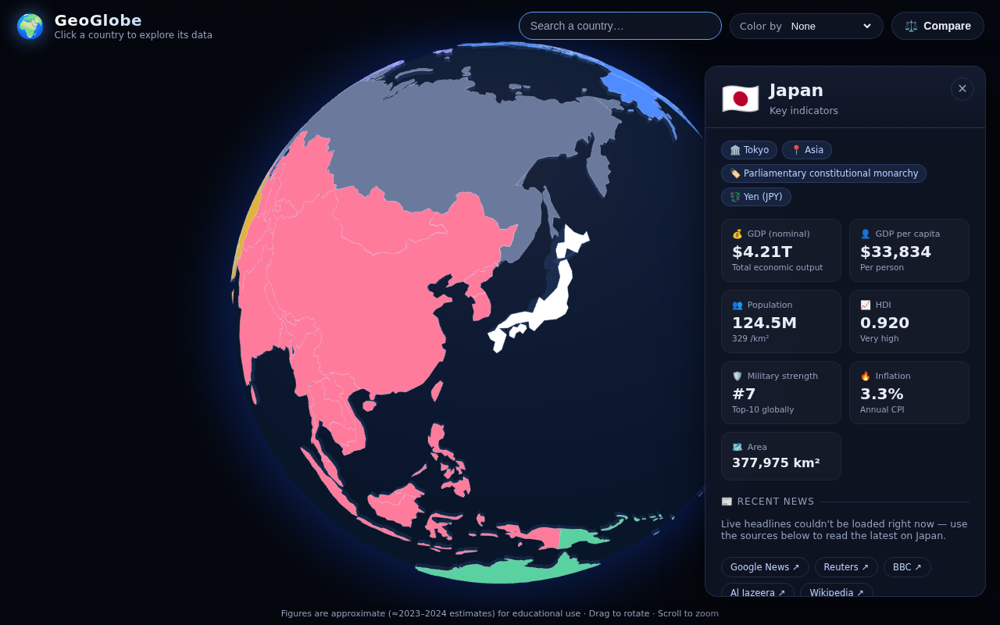
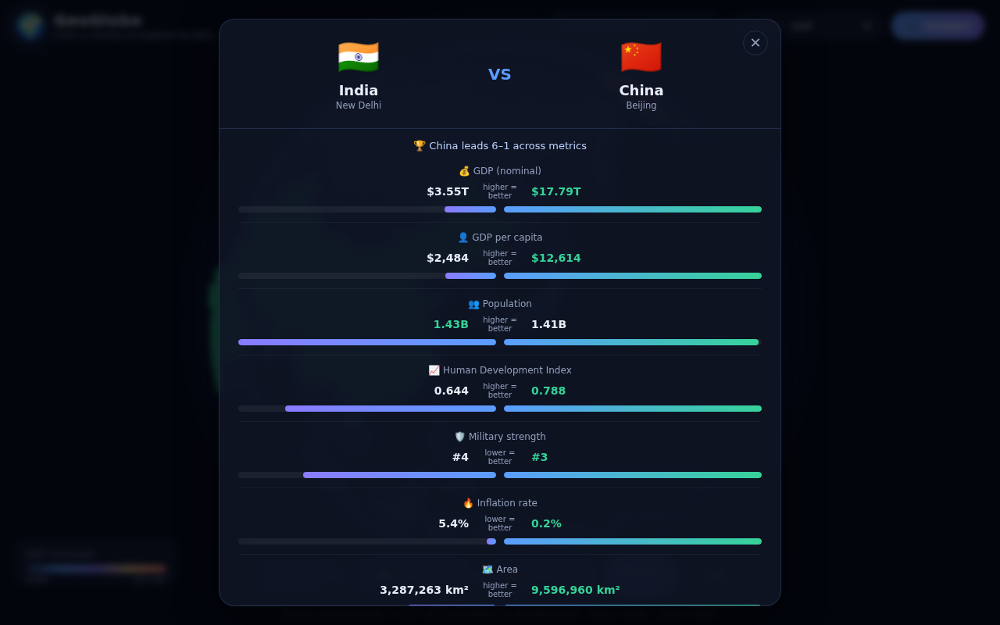

# 🌍 GeoGlobe

An interactive **3D globe** for exploring the world's countries. Spin the
planet, click any country, and get its key geopolitical and economic data —
GDP, GDP per capita, population, HDI, military strength, inflation and recent
news — then put any two nations head‑to‑head with the built‑in **comparison
tool**.



## ✨ Features

- **Interactive 3D globe** built with [`globe.gl`](https://github.com/vasturiano/globe.gl)
  (Three.js). Drag to rotate, scroll to zoom; gentle auto‑rotation until you
  interact. Countries are rendered as raised, hoverable polygons.
- **Click a country → full data panel** with:
  - 💰 GDP (nominal) and 👤 GDP per capita
  - 👥 Population (and density)
  - 📈 Human Development Index (with tier)
  - 🛡️ Military strength (Global Firepower rank)
  - 🔥 Inflation rate
  - 🗺️ Area, plus capital, government type and currency
- **📰 Recent news** — live headlines pulled from Google News for the selected
  country, with graceful fall‑back to direct source links (Google News,
  Reuters, BBC, Al Jazeera, Wikipedia) when live fetch isn't available.
- **⚖️ Comparison tool** — pick any two countries and see them side by side:
  per‑metric values, a winner highlight, proportional bars, and an overall
  verdict ("Country X leads N–M across metrics").
- **🎨 Color the globe by a metric** (GDP, GDP per capita, population, HDI,
  military rank, inflation) with a live legend.
- **🔎 Search** any country by name to fly to it instantly.
- Fully **responsive** and **self‑contained** — no API keys, no external map
  tiles; the country geometry is bundled into the build.



## 🚀 Getting started

```bash
npm install      # install dependencies
npm run dev      # start the dev server (http://localhost:5173)
```

To create a production build and preview it:

```bash
npm run build    # outputs static files to dist/
npm run preview  # serve the built site
```

The `dist/` folder is a static site — deploy it to GitHub Pages, Netlify,
Vercel, S3, or any static host. The Vite config uses a relative base path so it
works from a sub‑directory too.

## 🧱 How it works

| Piece | File |
| --- | --- |
| Globe, interactions, panels, compare, search | `src/main.js` |
| Curated country dataset (keyed by ISO‑3 code) | `src/data/countries.js` |
| World country geometry (Natural Earth, bundled) | `src/data/world.json` |
| Value formatting & profile merging | `src/lib/format.js` |
| News fetching & source links | `src/lib/news.js` |
| Styling (dark "space" theme) | `src/style.css` |

Each clickable polygon is matched to the curated dataset by its 3‑letter
country code. Countries that aren't in the curated set still show whatever the
underlying map data provides (population / GDP estimates) and are clearly
marked as **limited data**, so nothing on the globe is ever a dead click.

### Live news

Browsers can't read the Google News RSS feed cross‑origin, so headlines are
routed through public, no‑key CORS proxies (`allorigins`, `corsproxy.io`). If
every network attempt fails (offline, proxy down, ad‑blocker, etc.) the panel
still shows the curated source links, so the news section is never empty.

## 📊 Data & accuracy

Figures are **approximate**, compiled from publicly available estimates for
roughly **2023–2024**, and are intended for educational / illustrative use —
not as an authoritative source. Country geometry comes from the
[Natural Earth](https://www.naturalearthdata.com/) `admin_0` 1:110m dataset
(public domain), bundled via the `three-globe` package.

To add or correct a country, edit `src/data/countries.js` — the key must match
the country's 3‑letter code as used by the map (`ADM0_A3` / ISO‑3).

## 🛠️ Tech stack

- [Vite](https://vitejs.dev/) — build tooling & dev server
- [globe.gl](https://github.com/vasturiano/globe.gl) + [Three.js](https://threejs.org/) — 3D globe
- Vanilla JS, no UI framework

## 📄 License

MIT
